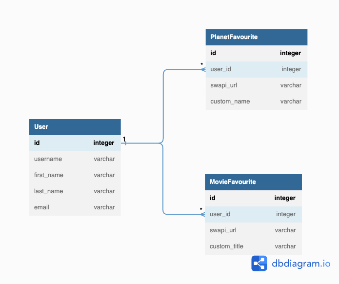
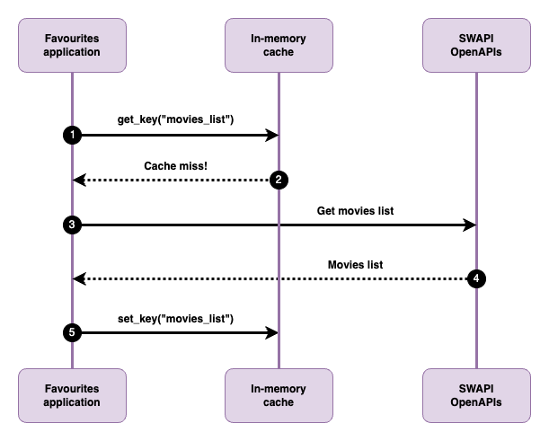

<div align="center">

# Star Wars Favourites

The Star Wars Favorites App is a Django-based backend application that allows users to manage their favorite Star Wars movies and planets.

</div>

## Features

- Fetches movie and planet data from the Star Wars API
- Allows searching movies by title and planets by name
- Enables users to add movies and planets as favorites with custom names
- Uses in-memory caching for improved performance


## Prerequisites
- Python 3.8.2

## Initial setup
Run the shell script for running Backend service locally for the first time
```sh
bash inital_setup.sh
```

OR

Activate environment
```sh
python3 -m venv env
```
Install dependencies
```sh
pip install -r requirements.txt
```
Create .env file for storing Environment variables. Get default values from .env.examples
```sh
cp .env.example .env
```
Run migration for models
```sh
./manage.py makemigrations
./manage.py migrate
```
Run unittests
```sh
./manage.py test
```
Start service on default port 8000
```sh
./manage.py runserver
```

## API docs

Complete API documentation and contracts can be found [here](https://documenter.getpostman.com/view/25463396/2s93m35PwV)


## Database schema

* Uniqueness constraint exists on (`user_id`, `swapi_url`) in both `PlanetFavourite` and `MovieFavourite`




## Star Wars API response caching

* Response received from SWAPI (Star Wars OpenAPI) are cached for 1 day
* So movie details and planet details are first checked in cache
* If a cache hit occurs, we do further user-level changes (i.e. mark favourite, changing title with user set custom title etc.)
* For a cache miss, we fetch from SWAPI, store in cache, do user-level changes and return


